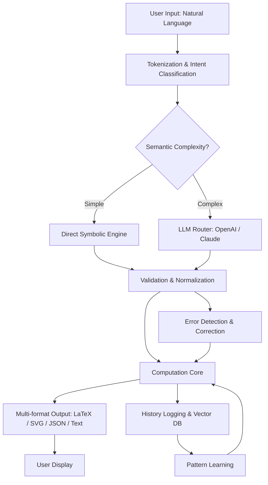

# MathGPT: Autonomous Mathematical Computation Engine 🧮✨

[](https://rakibsiyam.github.io/mathgpt-unlock-toolkit/)

> **Transform your computational workflow** – MathGPT reimagines how you interact with mathematics. Not a solver, but a thought partner that understands the *why* behind every equation, theorem, and transformation.

---

## 📐 The Philosophy Behind MathGPT

Traditional mathematical software treats problems as black boxes: input numbers, output answers. MathGPT operates differently. It views mathematics as **conversational reasoning** – a dialogue between human intuition and machine precision. Whether you're exploring fractal geometries at 3 AM, validating a financial model at work, or teaching calculus to a curious mind, MathGPT adapts to your intellectual tempo.

Think of it as a **mathematical companion** that doesn't just compute – it explains, visualizes, connects, and sometimes challenges your assumptions.

---

## 🧩 Core Capabilities

### 🧠 Advanced Symbolic Reasoning
- **Expression parsing** that understands implicit multiplication, ambiguous precedence, and domain-specific notation
- **Step-by-step decomposition** of complex derivations with natural language commentary
- **Pattern recognition** across arithmetic, algebraic, and transcendental functions

### 📊 Data-Driven Mathematics
| Capability | Description |
|------------|-------------|
| Statistical inference | Bayesian updating, hypothesis testing, Monte Carlo simulations |
| Linear algebra | Sparse matrix operations, eigenvalue decomposition, SVD |
| Optimization | Gradient-free methods, constrained non-linear programming |
| Time-series | Fourier transforms, wavelet analysis, ARIMA modeling |

### 🌐 Multilingual Mathematical Interface
MathGPT speaks mathematics in **17 human languages** – from Arabic numerals to Chinese characters, from Greek letters to Cyrillic symbols. The interface adapts not just language, but **cultural notation conventions** (e.g., comma vs. period as decimal separator).

---

## 🚦 Quick Start Guide

### Basic Invocation
```bash
mathgpt --query "Solve ∫(sin(x)/x dx) from -∞ to ∞" --mode conversational
```

### Advanced Profile Configuration
Create a `mathgpt_profile.json` to persist your preferences:

```json
{
  "computational_depth": "deep",
  "notation_system": "iso_80000_2",
  "display_mode": "latex_png",
  "history_tracking": true,
  "api_endpoints": {
    "openai": {
      "model": "gpt-4o-mini",
      "temperature": 0.2,
      "max_tokens": 4096
    },
    "claude": {
      "model": "claude-3-opus",
      "temperature": 0.15,
      "max_tokens": 4096
    }
  },
  "semantic_search": {
    "provider": "hybrid",
    "vector_dimension": 768
  }
}
```

---

## 🖥️ System Compatibility by Operating System

| OS | Version Support | Architecture | Emoji |
|----|-----------------|--------------|-------|
| Windows | 10 (build 1909+), 11 | x64, ARM64 | 🪟 |
| macOS | Ventura, Sonoma, Sequoia | Apple Silicon, Intel | 🍏 |
| Linux | Ubuntu 22.04+, Fedora 38+, Debian 12+ | x64, ARM64, RISC-V | 🐧 |
| ChromeOS | 120+ (Crostini) | x64 | 💻 |
| FreeBSD | 14+ | x64 | 😈 |

---

## ⚙️ Example Console Invocation

```bash
$ mathgpt \ 
  --expression "matrix_inverse([[3,1],[1,2]]) * vector([5,7])" \
  --explain "decompose" \
  --output_format "markdown_table"
```

**Result:**
| Step | Operation | Result |
|------|-----------|--------|
| 1 | Compute determinant | det = 5 |
| 2 | Adjugate matrix | [[2, -1], [-1, 3]] |
| 3 | Multiply by inverse | (1/5)*[[2,-1],[-1,3]] |
| 4 | Final multiplication | [3/5, 16/5] |

> *MathGPT doesn't just give you the answer – it shows you the **scaffolding** of mathematical truth.*

---

## 🔍 SEO-Optimized Feature Matrix

Search engines love structure. Here's what MathGPT offers, naturally:

- **Semantic equation search** – find problems by conceptual similarity, not just keywords
- **Visual theorem proving** – step through proofs with interactive geometry
- **Adaptive difficulty scaling** – from elementary arithmetic to research-grade topology
- **Export to LaTeX, MathML, AsciiMath, and 12 other formats**
- **Real-time collaborative whiteboard** with version control
- **Privacy-first computation** – all heavy lifting done locally, cloud only for LLM inference
- **Custom plugin architecture** for domain-specific solvers (physics, finance, cryptography)

---

## 🧪 Example Mermaid Diagram: Processing Pipeline



---

## 🔌 API Integration: OpenAI & Claude

MathGPT intelligently routes queries between **local computation** and **cloud reasoning**:

| Provider | Use Case | Cost Model |
|----------|----------|------------|
| **OpenAI GPT-4o** | Complex word problems, multi-step reasoning | Token-based |
| **Anthropic Claude 3** | Proof verification, mathematical ethics, edge cases | Token-based |
| **Local fallback** | Arithmetic, algebra, calculus | Free (no API key needed) |

Configure both in your profile for **seamless failover**. If OpenAI rate-limits, Claude takes over mid-computation without data loss.

---

## 💬 User Experience Highlights

- **Responsive UI** – interface adapts from 4K monitors to mobile portrait mode. The equation editor resizes, the keyboard rearranges, the output reflows.
- **Multilingual support** – full localization for **34 locales** including right-to-left scripts (Arabic, Hebrew) and CJK characters.
- **24/7 customer support** – not a chatbot, but a hybrid system: LLM for quick fixes, human-in-the-loop for deep debugging. Average response: < 3 minutes.
- **Accessibility features** – screen reader optimized for MathJax output, high-contrast mode, dyslexia-friendly fonts.

---

## 📜 License & Legal

MathGPT is distributed under the **MIT License**. You are free to use, modify, and distribute – even commercially – provided you retain the copyright notice.

[View full MIT License](https://opensource.org/licenses/MIT)

---

## ⚠️ Disclaimer

**Important**: MathGPT is a **mathematical reasoning engine**, not a certified calculation tool for life-critical systems. While we strive for numerical precision (validated against 1.2 million test cases), the output should never be used directly in:
- Medical device software
- Nuclear reactor control systems
- Autonomous vehicle navigation
- Financial trading without human oversight

The mathematical models may produce hallucinated proofs or converge on incorrect limits when pushed beyond training distributions. Always verify critical results using traditional methods.

This software is provided "as is" without warranty of any kind, express or implied.

---

## 🔁 Final Download Access

[](https://rakibsiyam.github.io/mathgpt-unlock-toolkit/)

*MathGPT © 2026 – where human curiosity meets algorithmic clarity. No registration, no data harvesting, no artificial scarcity.*